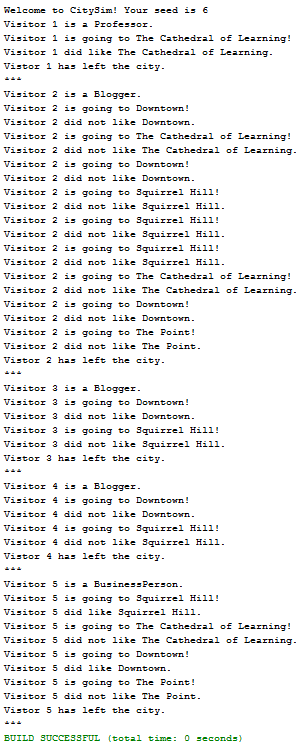
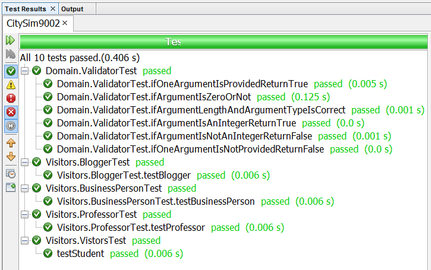

# CitySim9002

IS2545 - DELIVERABLE 2: Unit Testing

By Gaole Yu gay8@pitt.edu

1. Issues that faced:
  * Hard to write test code before writing the program
  * Hard to test void functions
  * Hard to understand stubbing and doubles at the beginning
  * Hard to design testable code

2. Object-oriented design
  * Designed Visitors class and subclasses for Student, Professor, BusinessPerson and Blogger.
  * Designed different methods to fulfill the requirements of the program.

3. Program Results

  

4. Test Results

  
